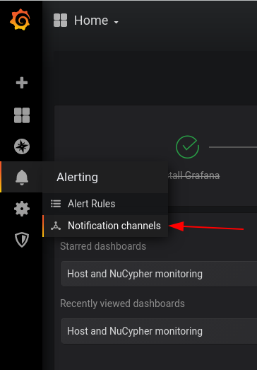
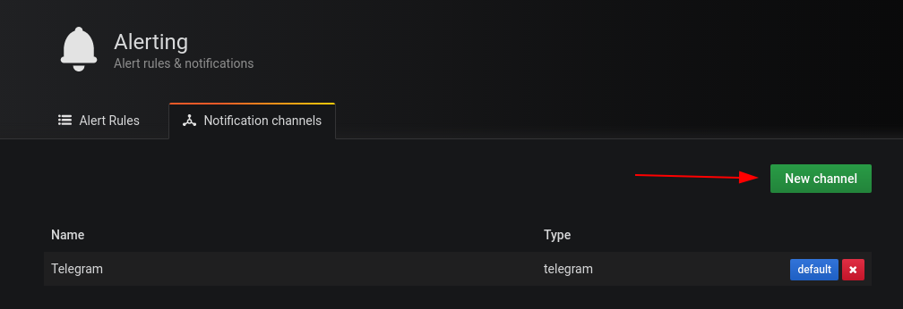
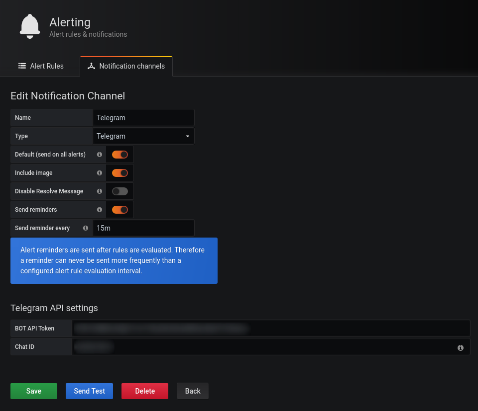
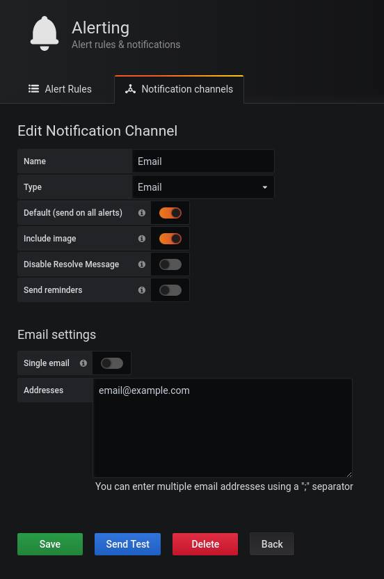
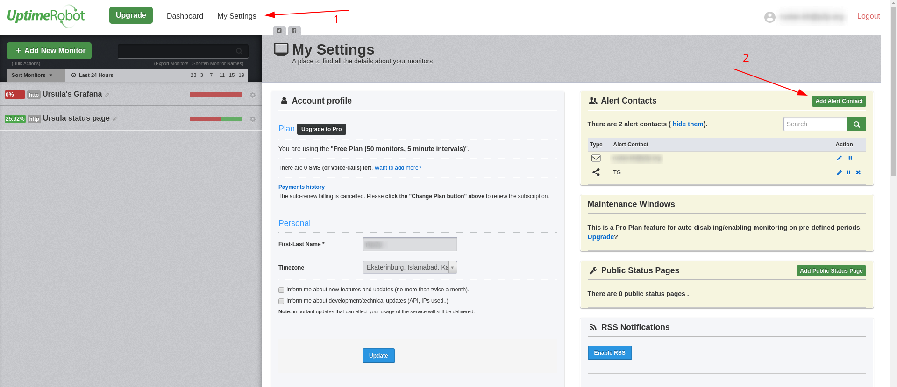
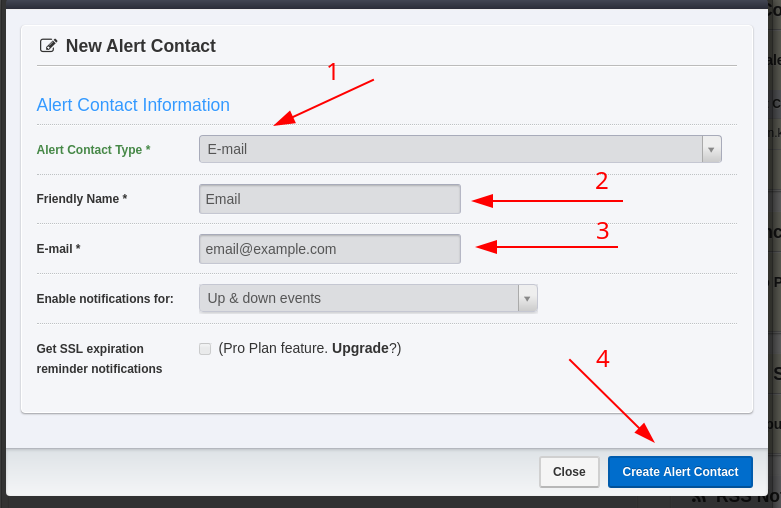
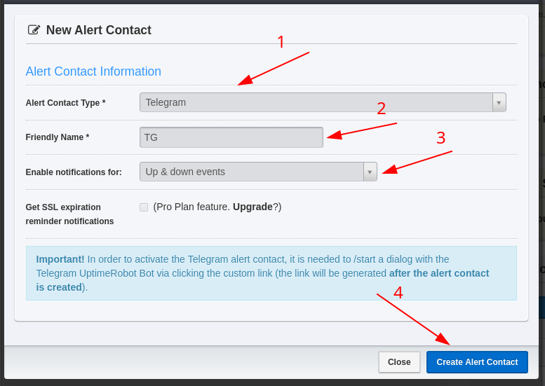
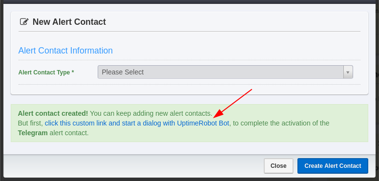
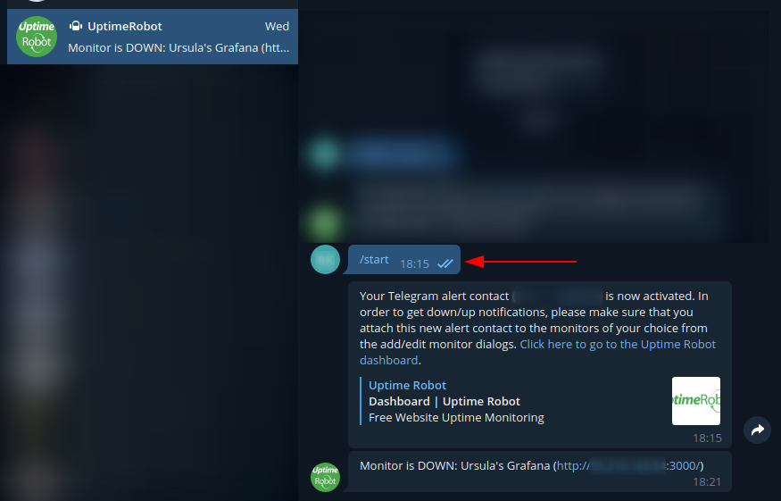
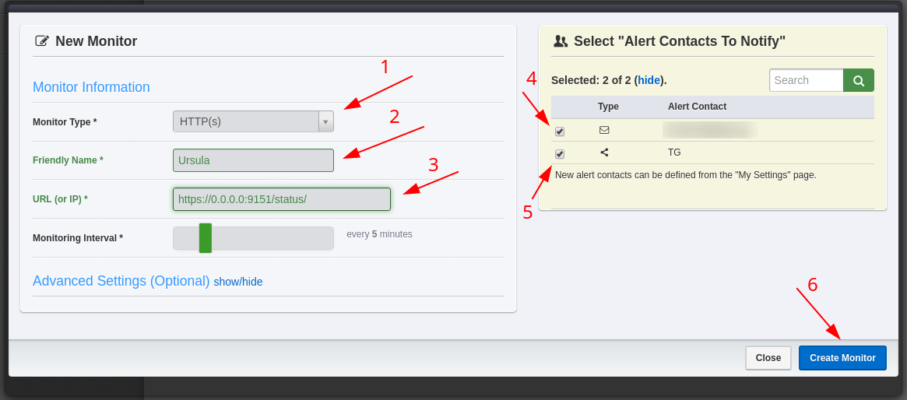

# README

## Disclaimer

This guide was wrote for persons who complete NuCypher installation guide using [SystemD service installation](https://docs.nucypher.com/en/latest/guides/installation_guide.html#systemd-service-installation).  
The guide was tested on Ubuntu 18.04 and should be applicable to all deb-based distributions.

## Pre-Installation

1. Clone repo

    ```shell
    git clone https://github.com/p2p-org/nucypher-monitoring.git
    ```

## Installation

1. Install docker and docker-compose if you didn't it before. Don't forget execute it from `root` user.

    ```shell
    curl -fsSL https://get.docker.com -o- | sh

    curl -fsSL https://github.com/docker/compose/releases/download/1.25.4/docker-compose-`uname -s`-`uname -m` -o /usr/local/bin/docker-compose && \
    chmod +x /usr/local/bin/docker-compose && \
    ln -s /usr/local/bin/docker-compose /usr/bin/docker-compose && \
    curl -fsSL https://raw.githubusercontent.com/docker/compose/1.25.4/contrib/completion/bash/docker-compose -o /etc/bash_completion.d/docker-compose
    ```

2. Install node-exporter, set listening address to `127.0.0.1` and enable expose systemd metrics.
You can use bash-script `install-prometheus-node-exporter.sh` for automated install. Don't forget execute it from `root` user.

    ```shell
    ./install-prometheus-node-exporter.sh
    ```

## Pre-Launching

**NB: this setup exposes grafana publicly over HTTP. For a more secure setup consider getting a domain and setting up SSL or using [ngrok](https://ngrok.com/).**

You need to setup environment variables.

1. Open file `grafana.env` in any text editor;
2. Replace `0.0.0.0` in `GF_SERVER_ROOT_URL` with your server's external address or DNS name for correct url in alert notifications;
3. If you want to receive email notifications then you need to configure SMTP settings:
    * Replace `host:port` in `GF_SMTP_HOST` with your SMTP server DNS name or IP and port;
    * Set `GF_SMTP_USER`,`GF_SMTP_FROM_ADDRESS` and `GF_SMTP_PASSWORD` to Email/Password from which the notifications will be sent.
4. Save changes.

For example, for the address admin@gmail.com:
```shell
GF_SMTP_HOST=smtp.gmail.com:465
GF_SMTP_USER=admin@gmail.com
GF_SMTP_PASSWORD=examplePassword
GF_SMTP_FROM_ADDRESS=admin@gmail.com
```

Do not use your main e-mail account for this, register a throwaway.

## Launching

1. Run docker-compose.

    ```shell
    docker-compose up -d
    ```

Now you can see your dashboard at http://your.server.ip.address.or.dns.name:3000/.

## Configure alert channels

### Telegram

1. Get token by telegram bot [guide](https://core.telegram.org/bots#6-botfather) and your chat id (You can get it by @get_id_bot or any other way you know how);
2. Go to grafana `Alerting` -> `Notification channels`;

    

3. Click on `New channel` button;

    

4. Select `Type` -> `Telegram`;
5. Fill `Name`, paste your bot token to `BOT API Token` field and your chat id to `Chat ID` field. Click on `Send Test` to check the sending of alerts and if it's OK click on `Save` button;
6. Additionally you can set another options for including image  into messages, send reminders, etc. Like on screenshot below.

    

### OpsGenie

1. Get API key by [OpsGenie documentation](https://docs.opsgenie.com/docs/api-key-management);
2. Repeat items 2,3 list above;
4. Select `Type` -> `OpsGenie`;
5. Fill `Name`, paste your API key to `API key`. Click on `Send Test` to check the sending of alerts and if it's OK click on `Save` button;

### Email

1. Go to grafana `Alerting` -> `Notification channels`;
2. Click on `New channel` button;
3. Select `Type` -> `Email`;
4. Fill `Name` and fill in the `Addresses` field with the Emails to which notifications will be received.

    

## Configure external HTTP monitoring

We highly recommended to configure external HTTP monitoring for grafana dashboard and ursula's status page.

### UptimeRobot.com

#### Configure alert contacts

##### Email

1. Go to `My settings` (1) and click on `Create Alert Contact` (2).

    

2. Fill all fields like on screenshot.

    

3. Click on `Create Alert contact` (4).

##### Telegram

1. Go to `My settings` and click on `Create Alert Contact`.
2. Fill all fields like on screenshot.
3. Click on `Create Alert contact`.

    

4. Click on custom link (see screenshot). It will open Telegram chat with UptimeRobot bot.

    

5. Type command `/start`.

    


#### Create monitor

Create one monitor for Ursula's status page URL `https://YOUR_SERVER_EXTERNAL_IP:9151/status/` and another one for grafana dashboard URL (e.g. `http://YOUR_SERVER_EXTERNAL_IP:3000/`)

1. Go to dashboard, click on `Add New Monitor`.

    

2. Select `Monitor type` -> `HTTP(s)` (1).
3. Fill `Friendly name` (2), `URL (or IP)` (3), and select needed `Alert contacts` (4)(5).
4. Click on `Create Monitor` (6).

    
